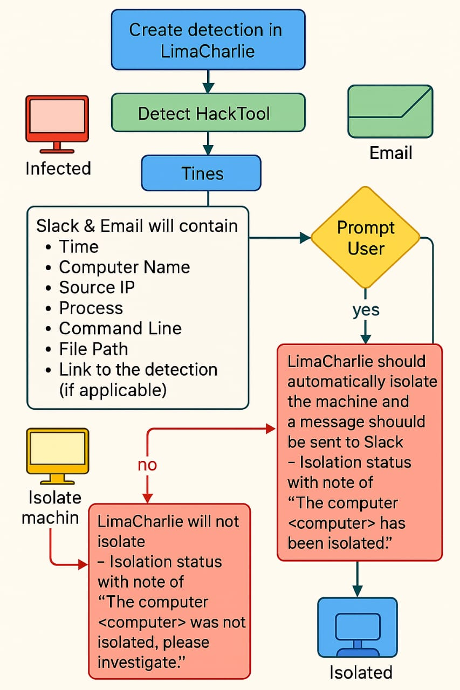
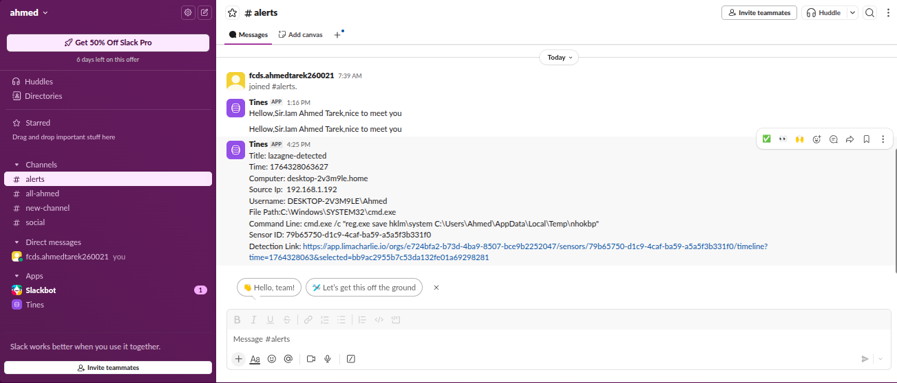
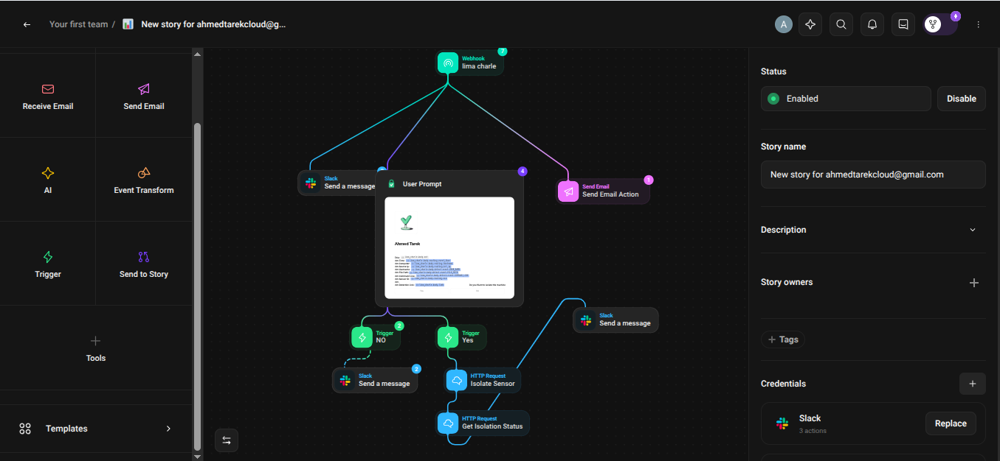
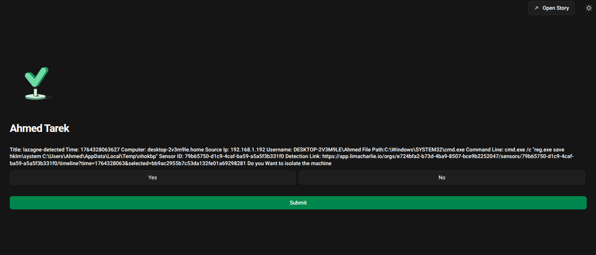
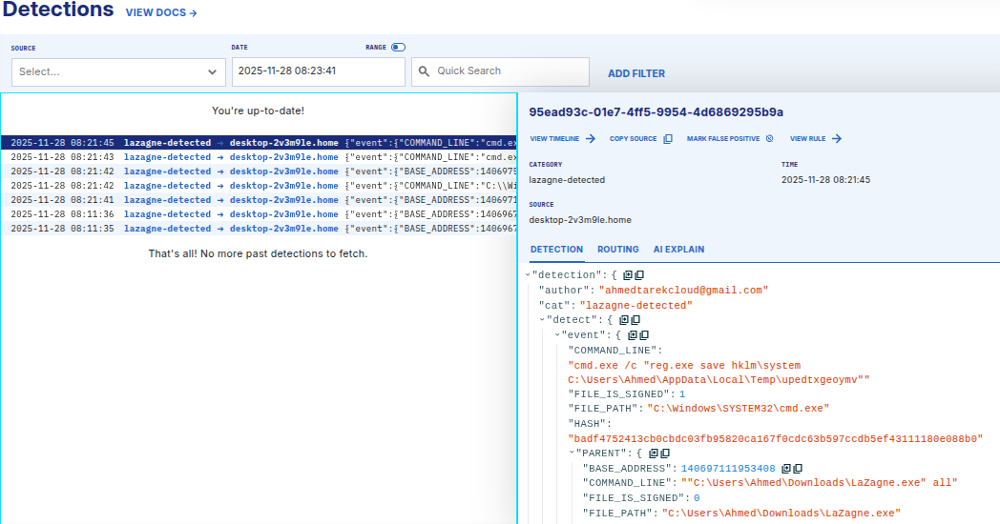
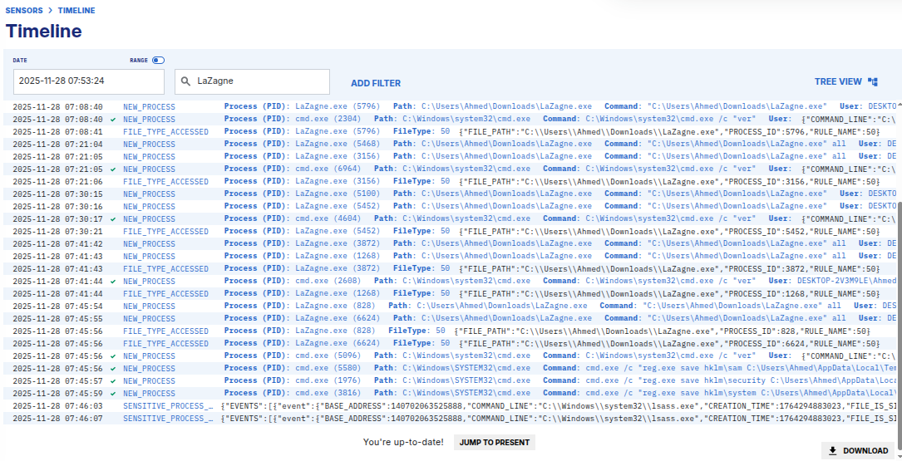
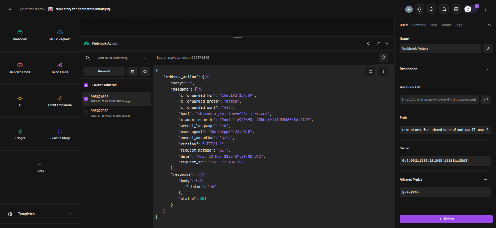

# 🔥 LimaCharlie + Tines + Slack SOAR Automation Pipeline

A fully automated **Blue Team / SOC** workflow integrating **LimaCharlie (EDR)**, **Tines (SOAR)**, and **Slack (Alerting)** to detect, triage, and respond to credential‑harvesting tools such as **LaZagne**.

This project demonstrates **enterprise‑grade security automation**, including:

* Real‑time threat detection in LimaCharlie
* Automated alert delivery to Slack & Email
* Analyst decision prompts
* Automated host isolation
* End‑to‑end evidence and workflow tracking

All execution evidence (screenshots) is stored in:
`/evidence/`

---

## 🚀 **Project Architecture**



This workflow provides:

* ✔ Detection of malicious tool execution
* ✔ Auto‑forwarding to Tines
* ✔ Slack alerting
* ✔ Analyst confirmation prompt
* ✔ Automatic isolation of infected system
* ✔ Full visibility & audit trail

---

## 🧠 **Technology Stack**

| Component           | Purpose                               |
| ------------------- | ------------------------------------- |
| **LimaCharlie EDR** | Detection, telemetry, isolation API   |
| **Tines SOAR**      | Automation, workflows, triage prompts |
| **Slack**           | Alerting & SOC communication          |
| **Email Alerts**    | Executive notifications               |
| **Windows Host**    | Target endpoint with LC sensor        |

---

## 🎯 **Use Case: Detecting LaZagne Execution**

The detection rule identifies:

* Process name & file path containing `LaZagne`
* Command line arguments
* OS being Windows

Once detected → event is immediately sent to **Tines**.

### 📌 LimaCharlie Detection Rule (YAML)

```yaml\ nop: and
events:
  - NEW_PROCESS
rules:
  - op: contains
    path: event/FILE_PATH
    value: LaZagne
  - op: contains
    path: event/COMMAND_LINE
    value: LaZagne
  - op: is
    path: event/OS
    value: windows
```

---

## 📡 **Slack Alerting**

Tines parses the incoming LC event and sends a structured alert to Slack including:

* Time of detection
* Hostname
* Local/External IP
* Executed file
* Command line used
* Link to detection in LimaCharlie



---

## 🧩 **Tines Story Workflow**

This story performs:

1. Receive webhook from LC
2. Parse detection fields
3. Send alert to Slack
4. Prompt analyst for YES/NO isolation
5. If YES → isolate via LC API
6. If NO → notify Slack & close case



The automated analyst prompt:



---

## 🛡 **Host Isolation Logic**

If analyst selects **YES** →

* Tines triggers LimaCharlie API
* Endpoint is isolated
* Slack receives confirmation message

If **NO** →

* Tines informs that machine was NOT isolated and requires investigation

---

## 🔍 **LimaCharlie Detection Evidence**

Screenshot from LC showing detection details:



Timeline of events during LaZagne execution:



---

## 🖥 **LimaCharlie Agent Installed Successfully**


---

## 🧪 **Webhook Testing in Tines**



---

## 🏆 **Project Outcomes**

This project demonstrates:

* ✔ Real SOC automation experience
* ✔ EDR detection engineering
* ✔ SOAR automation building
* ✔ Incident response workflow design
* ✔ Practical Slack integration
* ✔ Host isolation using API
* ✔ End‑to‑end attack simulation handling

This is the exact type of project security analysts, DFIR engineers, and SOC developers build inside real enterprises.

---

## 🌍 **How to Use This Repository**

**1. Clone the repo**

```bash
git clone <your-repo-url>
```

**2. Explore folders**

* `/evidence` → All screenshots
* `/rules` → LimaCharlie detection rules
* `/tines-story` → Exported Tines JSON
* `README.md` → Documentation

**3. Review detection logic**
**4. Review SOAR workflow**
**5. Rebuild your own pipeline using these steps**

---


